# Digital Oscilloscope and Arbitrary Function Generator
Two-channel digital oscilloscope and arbitrary function generator implemented in *VHDL* on a *Xilinx Artix-7* FPGA (*Basys 3* board)

**[Demo video](https://www.youtube.com/watch?v=-_-2ZNefMYU)**

**June 2026 - August 2026**

  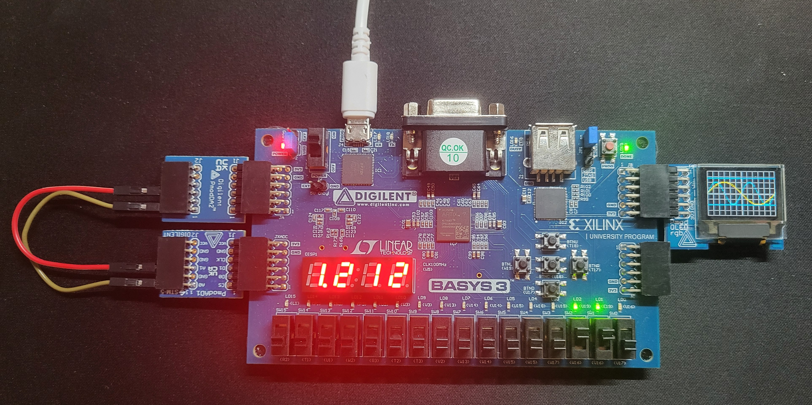

## Table of Contents

- [Project Overview](#project-overview)
- [Key Features](#key-features)
- [System Architecture](#system-architecture)
- [Testing](#testing)
- [Future Improvements](#future-improvements)

## Project Overview
The idea for this project originally came from a 2016 project built by two MIT students (see the Instrumentation entry under Final Projects — Memorable Projects on [this website](https://web.mit.edu/6.111/volume2/www/f2019/)). My original plan was to use a VGA display interface for the oscilloscope, but after several unsuccessful attempts, I switched to a 96x64 OLED screen with 16-bit color resolution instead.

The scope of this project was to design the digital pipeline between an ADC expansion board ([*Pmod AD1*](https://digilent.com/reference/pmod/pmodad1/reference-manual)) and an OLED screen ([*Pmod OLEDrgb*](https://digilent.com/reference/pmod/pmodoledrgb/reference-manual)), both hosted by the [*Basys 3*](https://digilent.com/reference/programmable-logic/basys-3/reference-manual) FPGA trainer board. The project was later extended to include a function generator, using a DAC expansion board ([*Pmod DA2*](https://digilent.com/reference/pmod/pmodda2/reference-manual)) to avoid relying on external lab equipment for testing and validation. The image below shows the required hardware arrangement.

  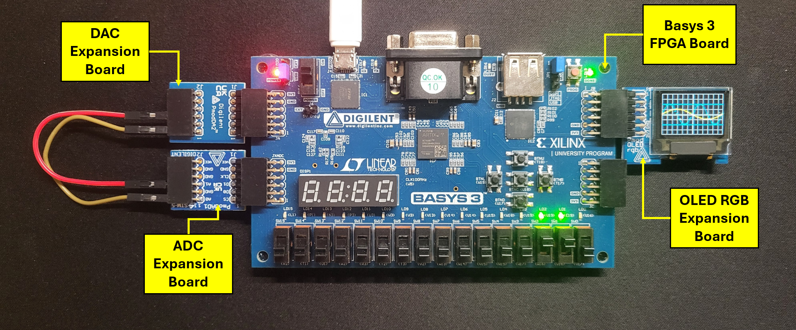

## Key Features
**Oscilloscope**
- Two-channel signal acquisition via 12-bit SPI ADC (*Pmod AD1*, [*AD7476*](https://www.analog.com/media/en/technical-documentation/data-sheets/AD7476_7477_7478.pdf)) at up to 917.4 kSPS
- 0V to 3.3V voltage input range with 1.65V assumed signal bias voltage
- Adaptive waveform reconstruction using Equivalent-Time Sampling (ETS) for full reconstruction of high-frequency signals
- Rising-edge trigger detection fixed at 1.65V
- User-adjustable horizontal and vertical scaling of displayed waveforms in the oscilloscope window
- Real-time cursor measurement system: on-screen cursor position converted to voltage (0–3.3V), 4 cursors across 2 channels
- Multiplexed 4-digit 7-segment display for last cursor voltage readout (see image below)
- OLED display ([*SSD1331*](https://cdn-shop.adafruit.com/datasheets/SSD1331_1.2.pdf), 96×64) for waveform rendering

  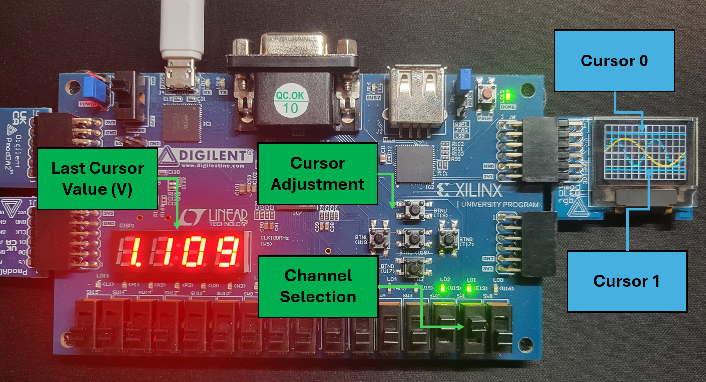

**Function Generator**
- Two independent arbitrary function generator channels (sine, square, ramp/sawtooth) with frequency and amplitude control
- User control interface for signal type, amplitude, and frequency adjustment for each output channel
- 12-bit SPI DAC output stage (*Pmod DA2*, [*DAC121S101*](https://www.ti.com/lit/ds/symlink/dac121s101-q1.pdf?ts=1786128322154&ref_url=https%253A%252F%252Fwww.google.com%252F)) for generating waveforms at up to 925.9 kSPS

  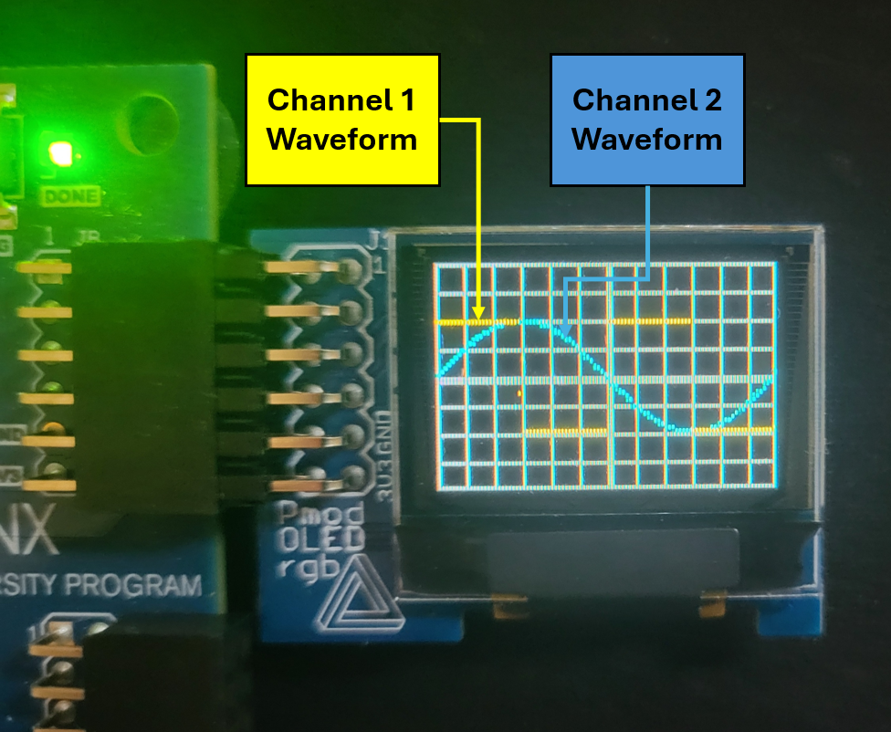

## System Architecture
This VHDL project's architecture is built around a top module that instantiates 14 submodules. Three of these submodules ("layer_compositor", "function_generator", and "input_manager") instantiate further submodules of their own, without any additional depth beyond that. This section covers the top module's architecture, along with the interfaces between modules, shown in the diagram below.

  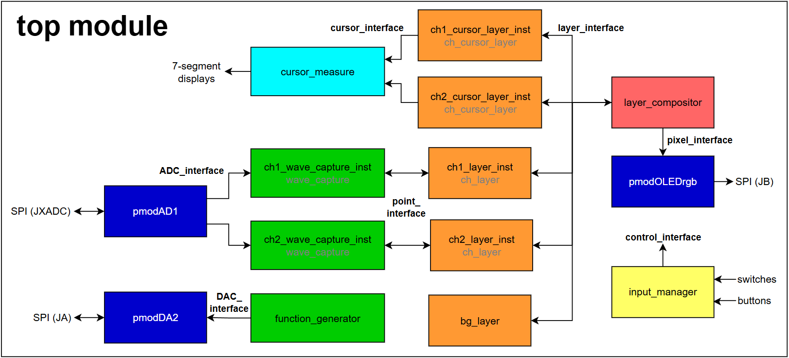

The highlighted interfaces from the diagram above are shown in more detail below:

  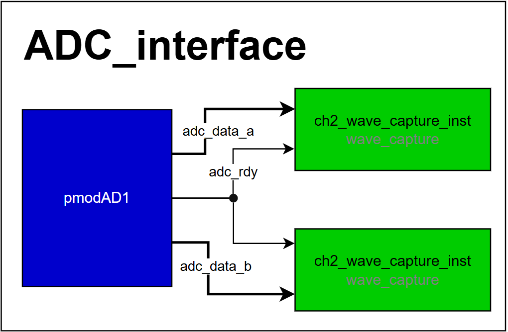
  &nbsp;&nbsp;
  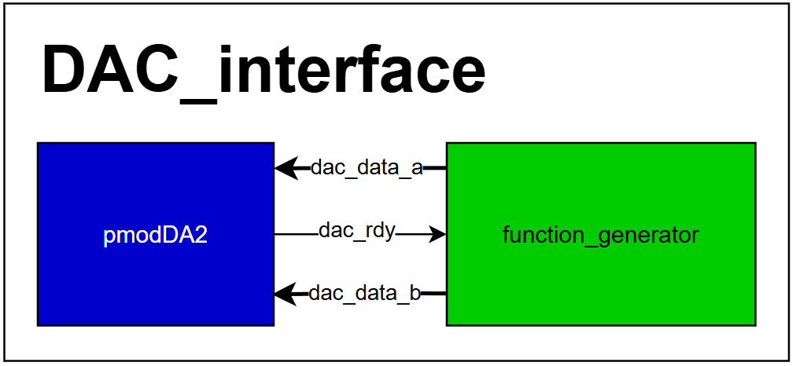
  &nbsp;&nbsp;
  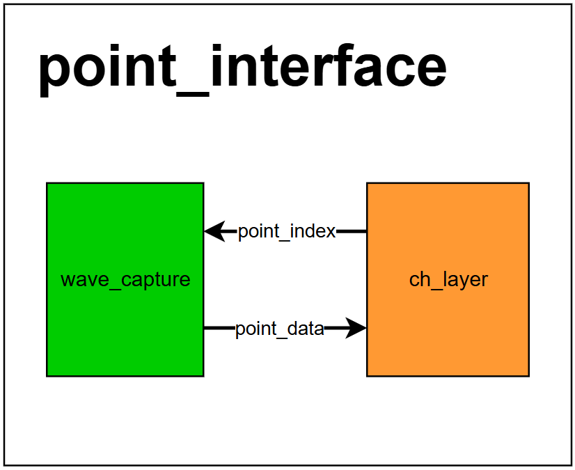
  &nbsp;&nbsp;
  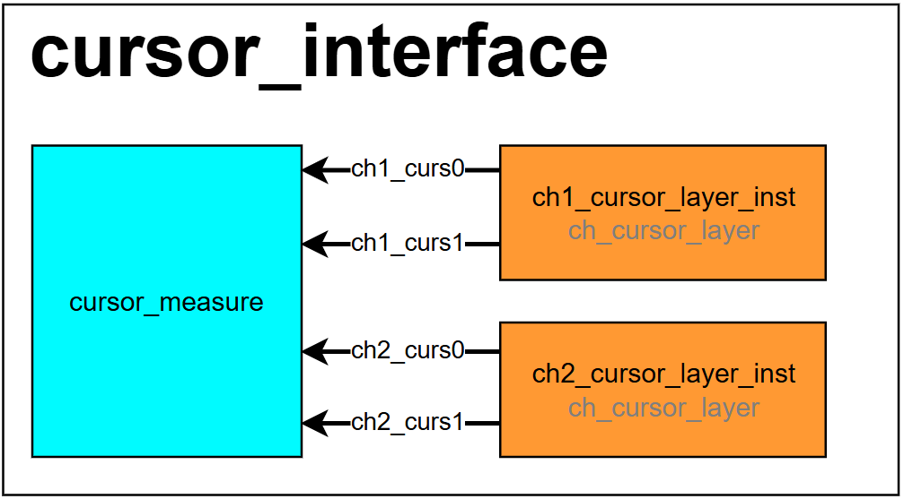
  &nbsp;&nbsp;
  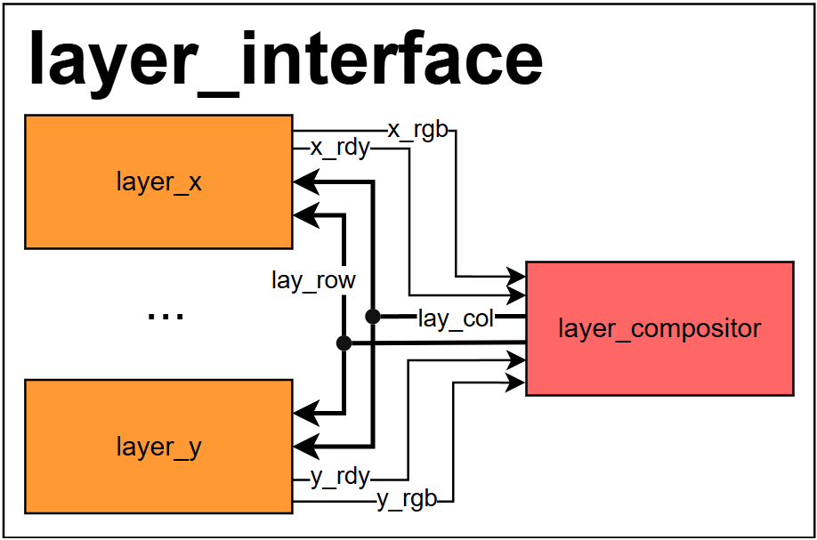
  &nbsp;&nbsp;
  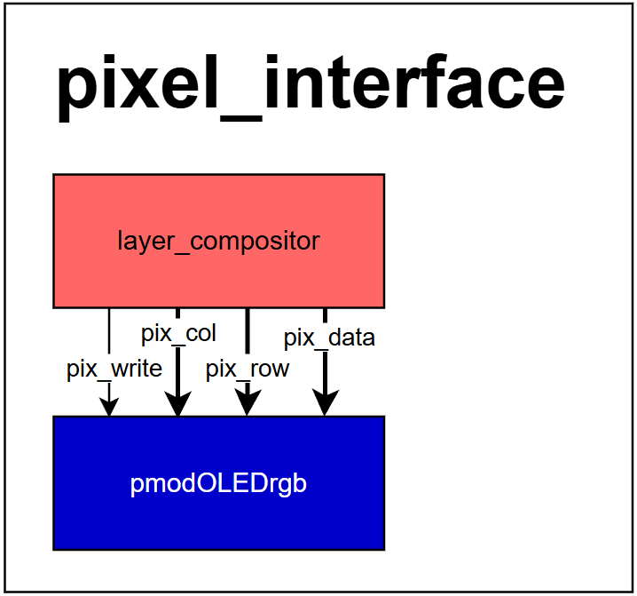
  &nbsp;&nbsp;
  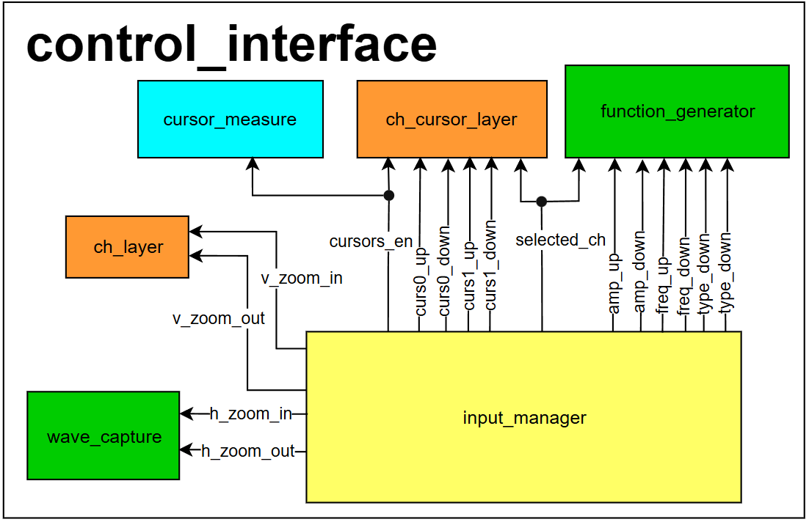

Here's an overview of what each submodule does, and which other modules they instantiate:

- **_"pmodOLEDrgb"_**: Interfaces with the OLED display controller (SSD1331, 96x64) over an SPI-like protocol. This is the only module in the project imported from an [online resource](https://yannick-bornat.enseirb-matmeca.fr/wiki/doku.php/en202:pmodoledrgb), since the OLED controller requires a very specific startup sequence and has a large set of user-programmable registers. It receives 7-bit column indices, 6-bit row indices, and 16-bit color values from the "layer_compositor" module, stores them in an internal bitmap array, and periodically transfers that bitmap to the OLED controller.
- **"layer_compositor"**: Allows oscilloscope elements ("layers") to be displayed on top of one another with priority ordering. For example, the "bg_layer" is the black-and-gray background grid of the oscilloscope window, while the waveform channels and cursor layers must be displayed above it and positioned relative to one another. Each external layer module provides a one-bit "active" flag (whether it should be displayed at a given row/column) and an RGB value for its color. This module keeps internal row and column counters, sweeps across the screen's pixels, polls each layer for the current pixel, and selects which layer's RGB value gets displayed. This module instantiates "delay_line" submodules to synchronize its interface timing with the *pmodOLEDrgb* module.
- **"bg_layer"**: The background layer. It interfaces with "layer_compositor", supplying the color of the background grid pattern for any given pixel on the screen.
- **_"pmodAD1"_**: Interfaces with the *Pmod AD1* ADC expansion board, which houses two ADC ICs each rated for up to 1 MSPS. In this project, the module reads 12-bit samples from these ADCs at a 917.4 kSPS rate over an SPI-like protocol and forwards the values to the "wave_capture" modules.
- **"wave_capture"**: Implements the digital signal processing needed for signal reconstruction and display, working alongside its associated "ch_layer" module. It uses Equivalent-Time Sampling: it anchors on detected rising-edge triggers of the input signal and, on each trigger event, registers one offset sample into an internal buffer (decimating the rest). This buffer is later read out and processed by the display layer for rendering via "layer_compositor". Because only one sample is registered per trigger cycle, this scheme reconstructs higher-frequency signals with better fidelity, but takes longer to update for lower-frequency signals — up to 96 trigger cycles (signal periods) for a full screen update. See [Future Improvements](#future-improvements) for ideas on improving this signal processing scheme. This module also accounts for the user-set horizontal zoom, adjusting how samples are registered so signals display at the correct horizontal scale.
- **"ch_layer"**: Interfaces with "layer_compositor" to display a waveform reconstructed by its associated "wave_capture" module instance. It takes the row and column indices from "layer_compositor", relays the column index to "wave_capture", and fetches the corresponding 12-bit value from its buffer. If that value matches the pixel row currently being considered by "layer_compositor", this module asserts its "active" output. This is also the module that applies the user-set vertical zoom, tracking the current zoom factor and adjusting the displayed waveform accordingly, while keeping it centered on the project's 1.65V reference voltage.
- **"ch_cursor_layer"**: Acts as both the display interface and the position handler for the cursors. One instance of this module exists per waveform channel; it keeps track of the current cursor positions internally and updates them in response to user button presses.
- **"cursor_measurement"**: Interfaces with the "ch_cursor_layer" module instances, taking the current cursor positions as input. Combined with the vertical zoom values from the "ch_layer" instances, it computes the analog voltage corresponding to each cursor, then displays the voltage of the last-moved cursor on the *Basys 3* board's 4-digit 7-segment display.
- **_"pmodDA2"_**: Interfaces with the *Pmod DA2* DAC expansion board, which houses two 12-bit DAC ICs with a theoretical output rate of 1 MSPS. This module outputs analog signal samples at an effective rate of 925.9 kSPS, implementing the SPI-like interface to the *Pmod DA2* board and consuming a continuous stream of 12-bit values supplied by the "function_generator" module.
- **"function_generator"**: Generates the analog signals for the project via the "pmodDA2" module and the DAC expansion board. It handles user-adjustable frequency and amplitude parameters and can switch between three signal types (sine, square, and sawtooth ramp). For each channel, it instantiates a "phase_accumulator" submodule, which accumulates a 24-bit phase value, and a lookup-table (LUT) submodule per signal type. Based on the user-set signal frequency, "function_generator" computes the 24-bit phase increment applied every system clock cycle (10 ns) and accumulates it into the current phase. The accumulated phase is then fed into the signal LUTs; depending on which signal type is selected for a given channel, the module selects one LUT's 12-bit output and scales it according to the requested amplitude. This module implements the entire digital backend for signal generation.
- **"input_manager"**: Takes raw button inputs, debounces them, and generates single pulses on button presses. It also reads three slide switches on the FPGA board, which configure what the buttons currently control, and maps button presses to the appropriate control signal for the relevant project module — for example, adjusting the oscilloscope's horizontal or vertical zoom, or moving a cursor's position.

## Testing
**Coming soon...**

The signals generated by the function generator will be measured and analyzed in both the time and frequency domain with an external oscilloscope. The project will also be tested against external signal sources, such as a trusted function generator, to measure the accuracy of the cursors, for example.

## Future Improvements
1. Instead of using only an Equivalent-Time-Sampling (ETS) scheme for the "wave_capture" module — which registers only one sample per signal trigger cycle and is slow and inefficient for lower-frequency signals — a hybrid of ETS and Real-Time-Sampling (RTS) with decimation of unwanted samples could be implemented. ETS could be used to reconstruct signals with frequencies closer to the ADC sample rate, while RTS could be used for lower-frequency signals whose periods are much longer than the sample time.

2. A second OLED or LCD display could be added for displaying textual values and measurements such as cursor voltages, signal frequencies, and the oscilloscope's current control mode.

3. An analog front end supporting a full ±10V measurement range, with signal conditioning down to the board's native 0V–3.3V range, could be added and designed using *op-amps* and other external circuits.

4. While the current horizontal and vertical scaling of the oscilloscope, as well as the frequency and amplitude settings of the function generator, all use power-of-two factors for ease of use, external rotary encoders or keyboards could be added to the project for more precise configuration of the generated waveforms and of the oscilloscope window.
